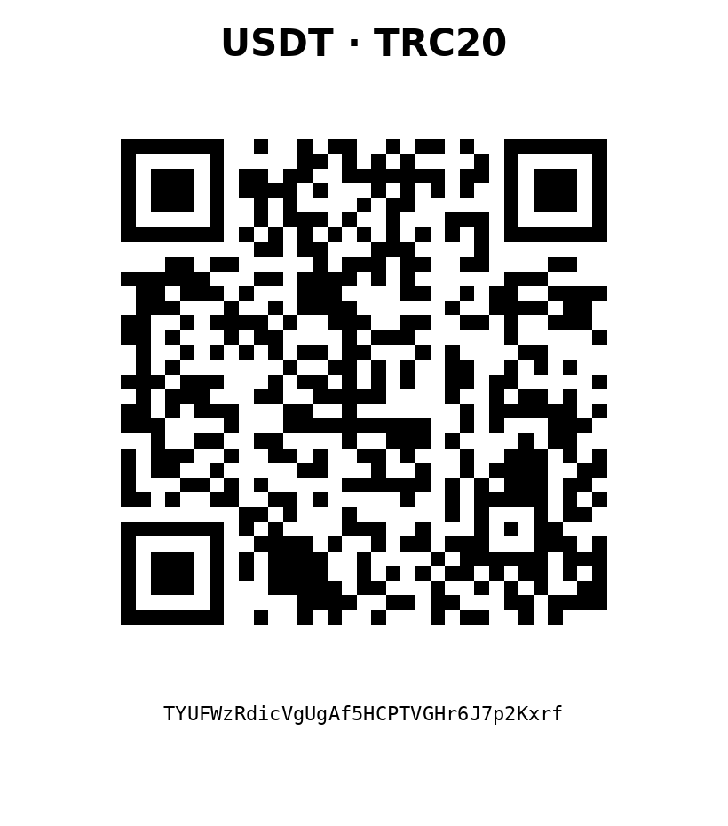

<p align="center">
  
</p>

<h1 align="center">🐉 Monster VPN</h1>

<p align="center">
  <strong>Break the firewall. Own your connection.</strong><br>
  A modern Android client powered by Xray-core and built for speed, privacy, and resilient connectivity.
</p>

<p align="center">
  <a href="https://github.com/anonymouskeys/Monster-VPN/releases/latest"></a>
  <a href="https://github.com/anonymouskeys/Monster-VPN/releases"></a>
  <a href="https://github.com/anonymouskeys/Monster-VPN/blob/main/LICENSE"></a>
  <a href="https://github.com/anonymouskeys/Monster-VPN/stargazers"></a>
  <a href="https://t.me/anonymouskeys"></a>
</p>

<p align="center">
  <a href="https://github.com/anonymouskeys/Monster-VPN/releases/latest"><strong>Download the latest signed APK</strong></a>
  ·
  <a href="https://t.me/anonymouskeys"><strong>Join the community</strong></a>
  ·
  <a href="#-support-development"><strong>Support development</strong></a>
</p>

---

## What is Monster VPN?

Monster VPN is an open-source Android client built around **Xray-core**. It brings modern proxy protocols, flexible routing, connection testing, and DPI-resistance tools together in one polished application.

The project is designed for people who need a fast, reliable, and transparent networking client without advertisements, telemetry, or user tracking.

> Monster VPN is a client application. Connection quality and censorship resistance depend on your server, configuration, protocol, and network environment.

## Highlights

| Core & protocols | Connectivity & privacy | Android experience |
|---|---|---|
| Xray-core | REALITY and XTLS | Material 3 dark interface |
| VLESS and VMess | uTLS fingerprinting | Fast profile management |
| Trojan and Shadowsocks | Packet fragmentation | Built-in latency testing |
| TUIC and Hysteria2 | ByeDPI integration | Signed release builds |
| SOCKS and HTTP | Flexible routing rules | No ads or telemetry |

## Why Monster VPN?

- **Built for modern networks** — support for current Xray transports and censorship-resistance techniques.
- **Fast profile checks** — built-in TCP and handshake testing helps identify working configurations quickly.
- **Privacy by design** — no advertising SDKs, telemetry, or user tracking.
- **Independent releases** — reproducible project automation and cryptographically signed APK builds.
- **Open development** — source code, issues, pull requests, and release history are public.

## Download

Get the newest signed Android package from the Releases page:

<p align="center">
  <a href="https://github.com/anonymouskeys/Monster-VPN/releases/latest">
    
  </a>
</p>

For your safety, download builds only from this repository's official Releases page.

## Supported technologies

`Xray-core` · `VLESS` · `VMess` · `Trojan` · `Shadowsocks` · `TUIC` · `Hysteria2` · `REALITY` · `XTLS` · `uTLS` · `SOCKS` · `HTTP` · `Fragmentation` · `ByeDPI`

## Build from source

Clone the repository and build the Android application with the included Gradle wrapper:

```bash
git clone --recursive https://github.com/anonymouskeys/Monster-VPN.git
cd Monster-VPN/V2rayNG
./gradlew assembleDebug
```

Release builds require a signing configuration. See [`docs/RELEASE_SIGNING.md`](docs/RELEASE_SIGNING.md) for the project's signing and CI setup.

## Community

News, beta builds, release announcements, and project discussion are published in the official Telegram channel:

<p align="center">
  <a href="https://t.me/anonymouskeys">
    
  </a>
</p>

## ❤️ Support development

Monster VPN is developed and maintained independently. Donations help fund testing, infrastructure, bug fixes, interface improvements, and support for new networking technologies.

<table>
  <tr>
    <th align="center">TON</th>
    <th align="center">USDT · TRC20</th>
  </tr>
  <tr>
    <td align="center"></td>
    <td align="center"></td>
  </tr>
  <tr>
    <td align="center"><code>UQCezHtAYYkC0eJW26rkXgdT4fG9f9m6m-3oQanpd4bpyrEG</code></td>
    <td align="center"><code>TYUFWzRdicVgUgAf5HCPTVGHr6J7p2Kxrf</code></td>
  </tr>
</table>

Please verify the network and full wallet address before sending funds. Only send TON-network assets to the TON address and USDT on TRON/TRC20 to the TRC20 address.

## Contributing

Bug reports, feature proposals, documentation improvements, and pull requests are welcome. Before opening a pull request, keep changes focused and describe how they were tested.

## License

Monster VPN is distributed under the **GPL-3.0 license**. See [`LICENSE`](LICENSE) for the full terms.

## Credits

Monster VPN stands on the work of outstanding open-source communities and projects, including:

- Xray-core
- v2rayNG
- sing-box ecosystem
- Android Open Source Project and the wider Android community

Please respect the licenses and attribution requirements of all upstream components.

---

<h2 align="center">⭐ Like Monster VPN?</h2>

<p align="center">
  Give the repository a star and share it with people who need a powerful Android networking client.
</p>

<p align="center">
  <strong>Freedom. Privacy. Performance.</strong><br>
  Built with passion by <a href="https://t.me/anonymouskeys">Anonymous Keys</a>.
</p>
